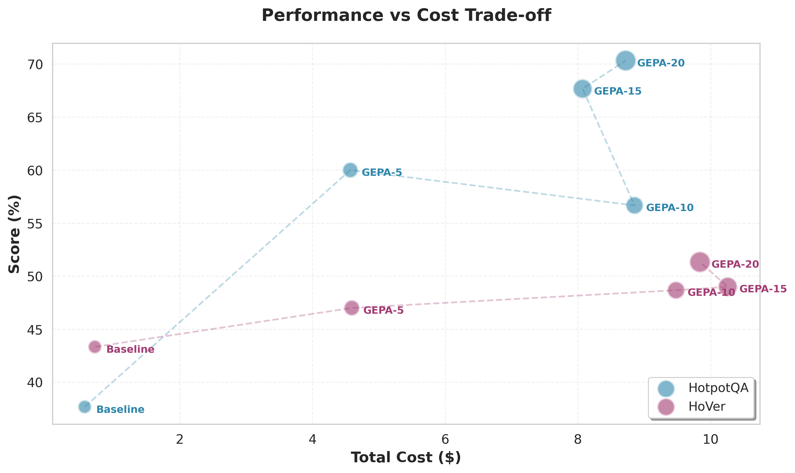

## 1. Background and Objective

- We aim to compare **self-evolving/self-optimizing systems** (GEPA, ACE) under different levels of *inner-loop search/evaluation intensity*, focusing on their **performance–cost–compute scaling behavior**.
- The key question: *how should we define the horizontal axis for scaling?*
- Initial candidates:
  - Number of rollouts  
  - Number of iterations  
  - Token usage  
  - Total cost (USD)

---

## 2. Current GEPA Experiments and Key Findings

**Model and Configurations:** `gpt-4o-mini` with configurations — `Baseline`, `GEPA-5`, `GEPA-10`, `GEPA-15`, `GEPA-20`

**Evaluation Datasets:** HotpotQA, HoVer (consistent with default script settings)


### Cost Scaling


### Performance-Cost Tradeoff




### Conclusions

1. **Costs remain roughly constant while performance improves with more iterations.**

   - GEPA-10/15/20 show similar API spending, but performance continues to increase.
   - The number of external API calls increases, but **total output tokens do not rise significantly**.
   - Iteration count could be a candidate, but its definition varies across frameworks.
   - The GEPA paper uses *rollouts* as its metric, but rollout semantics differ by architecture or task.

2. **Number of metric evaluations** may serve as a better scaling indicator. For example:

   ```python
   def one_metric_call(program, example):
       output = program(example.question)  # may internally call GPT 2–3 times
       # Step 2: Evaluate the result (possibly another GPT API call)
       score = metric_fn(example, output)  # may call GPT once more
       return score  # counted as 1 metric call
   ```

